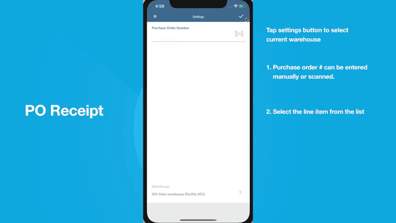
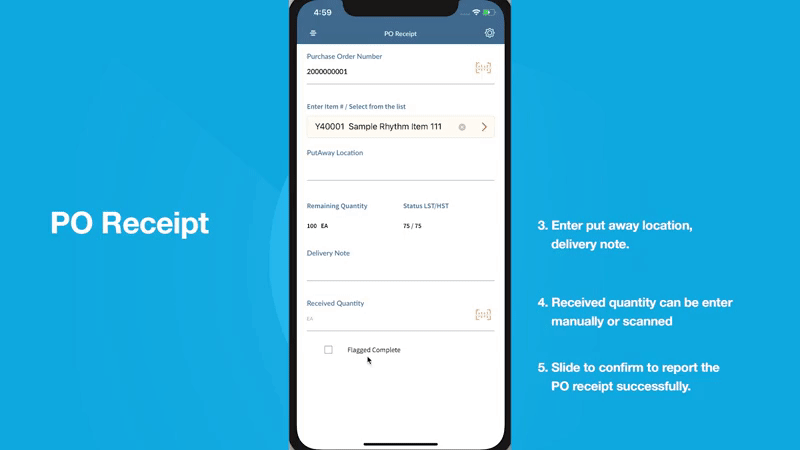

# User Guide - PO Receipt

# Table of contents

- **[About this guide](#about-this-guide)**
  - [Intended Audience](#intended-audience)
    - [PO Receipt standard functionality](#std-func)
- **[Workflow, Screen Layouts & API Logic](#wrk)**
  - [Settings](#settings)
  - [Purchase order number](#po)
  - [Line Items](#lines)
  - [Line Item Details](#line-details)
    - [Fill details](#fill-details)
  - [Report Item](#confirm-details)
- **[M3 sample workflow](#m3sample)**
  - [Create Purchase order PPS200](#crt-po)

# About this guide

### Intended Audience

MobileFirst Configuration User Guide provides guidance for LeanSwift customers and consultants regarding understanding the basic concept, functionality and configuration of the PO Receipt Standard App. Further information about MobileFirst standard applications can be found at [www.inform3marketplace.com](http://www.inform3marketplace.com).   

#### **PO Receipt standard functionality**

The purchase order receipt for Infor M3 provides the ability to receive purchase order into a warehouse.

# **Workflow, Screen Layouts & API Logic**

### Settings:

The current warehouse can be selected from tapping the settings icon on top right corner.

By default the logged in user default warehouse will be selected.

### Purchase #:

In the Purchase order number field enter manually using keyboard or scan from inbuilt camera.

​	

PO number entered will be sent to M3 and head details will be retrieved.

### Line Items:

On valid PO its line items will be fetched from M3.

### Line Item Details:

On selecting a line item from the list its details will be fetched and also line will be checked for container controlled or lot controllerd and the lot details will also be fetched.

### Fill details:

The location will be can be entered and this will be validated against M3. The quantity can be either scanned or entered manually using key board.

### Submit for Receipt

All the entered values will be validated and in case of container methods item then the packaging is checked and if there is no package then the item will be added to a package.

Finally the PO item will be reported for receipt in M3. The success/failure message will be shown.

# **M3 sample workflow**

This section describes the Pick Reporting workflow in M3 to create purchase order. The workflow can have variations depending on your current order processing- and dispatch settings.

The current warehouse selection can be made using the settings icon on top right corner of the screen.

### Create Purchase order PPS200

- Purchase order can be created in PPS200 by clicking [+] button.
- Enter supplier, order type and Req delivery date.
- Supplier will be defined in CRS620 and customer will be defined in CRS610
- Add line items for the order and specify the item quantity, price and goods receiving method
- Complete the order creation. It will be in status 15 - ready to send.

